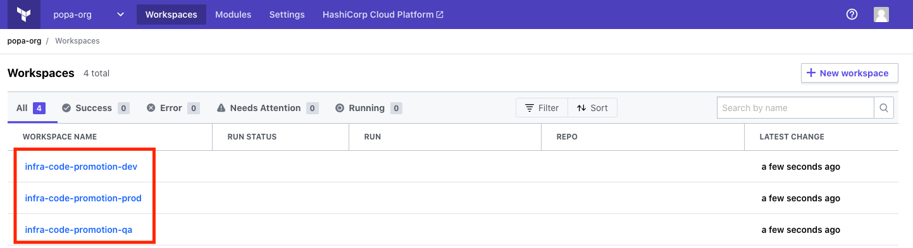

# infra-code-promotion
Infrastructure code promotion between dev/qa/prod environments

# Terraform version
This code was written with `Terraform v0.13.4`

# Assumption
- You have multiple environment (dev/qa/prod) where you are testing your infrastructure along with applications which are running on this infrastructure as result promote the infrastructure to PROD environment where it's consumed by end user
- You need to promote the changes from one environment to another in consistent workflow inside TFE using best practices of IaC
-  Along code promotion you'd like to use different tools like code testing, configuration management etc.

# Pre-requirements
- [TFE](https://www.terraform.io/docs/enterprise/index.html)
- [AWS](https://aws.amazon.com/) account

# How to consume

We are going to keep our state remote, in this example I'm going to use TFC but the example is relevant for TFE

```bash
git clone git@github.com:hc-use-cases/infra-code-promotion.git
```

Code which is creating workspaces and populating variables and environment variables might be part of separate workspace, but I'm keeping it local for simplicity of the example.

## TFE authentication

for TFE authentication you'll need [API token](https://www.terraform.io/docs/cloud/users-teams-organizations/api-tokens.html)


for local development you can use the `~/.terraformrc` like below

```bash
cat ~/.terraformrc
credentials "app.terraform.io" {
  token = "<API-TOKEN>"
}
```

for CI you need to use github secrets to consume API token - [reference doc](https://docs.github.com/en/free-pro-team@latest/actions/reference/encrypted-secrets)

## Create TFE environment

create workspaces for dev/qa/prod and populate it with variables

```bash
cd tfe/
terraform init
terraform apply
```

as result you'll have workspaces created in TFE for all 3 environments



## Remote configuration

in order to separate environments I'm going to use prefix for the name fo workspaces and use terraform workspaces select for [multi environments deployments](https://learn.hashicorp.com/tutorials/terraform/automate-terraform#multi-environment-deployment)

```bash
terraform {
  backend "remote" {
    organization = "popa-org"

    workspaces {
      prefix = "infra-code-promotion-"
    }
  }
}
```

## CI

To show the multiple deployments using `terraform workspace select` I'm using github actions.

The idea to use CI in the workflow is to be able to add any additional extra steps in infrastructure deployment like configuration management, testing etc.

> TFE is not a CI/CD

The example used in this repo will deploy all 3 environments in single pipeline. This not obligatory to be the case in your pipeline as well as for production, for example, you might use manual approval.

### Trigger CI
CI is triggered by push to the repository
